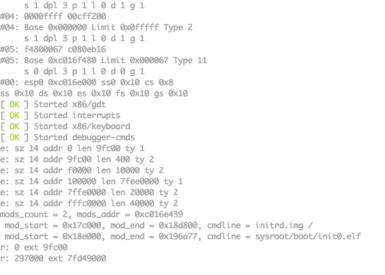

# AMIX

This is a *nix clone for x86 built heavily on top of JMTK from James Molloy (primarily because I got sick of fiddling with low level issues like physical page management).

Like JMTK, it's very modular - unlike JMTK it has actual userland code and syscalls and is aiming to be a reasonably complete *nix OS eventually.

Presently it's quite buggy, but things will improve.

## Build instructions

Install an i686-elf- GNU toolchain (if you don't know how to do that, you probably shouldn't be messing with osdev in general). I currently use gcc 4.7.2 and binutils 2.22.

Eventually i'll update it for more modern gcc, the main issue is the atomic builtins - patches are most welcome.

You will also need an install of nasm, I use version 2.14.

And to run the thing, an install of qemu is needed too.

Edit make.conf and ensure everything looks correct, then do "make all & make run-qemu" and you should see something like this:

